# 570 Church Softball League — Website

A full-featured website for a church softball league. It shows schedules, standings, rosters, and batting stats to everyone. Admins can manage teams, enter game results, upload scorebooks, and even text in results from the field.

> **Want to add screenshots?** Create a `docs/screenshots/` folder, drop your images in there, and replace the `> 📸 Screenshot:` placeholders below with ``.

---

## Table of Contents

1. [What the Website Does](#what-the-website-does)
2. [Special Features](#special-features)
   - [Text a Game Result from Your Phone](#text-a-game-result-from-your-phone)
   - [Live Scoreboard with GameChanger](#live-scoreboard-with-gamechanger)
   - [Batting Stats from GameChanger](#batting-stats-from-gamechanger)
   - [Upload a Paper Scorebook](#upload-a-paper-scorebook)
3. [Setting Everything Up From Scratch](#setting-everything-up-from-scratch)
   - [What You Need Before You Start](#what-you-need-before-you-start)
   - [Step 1 — Create a Supabase Project (Your Database)](#step-1--create-a-supabase-project-your-database)
   - [Step 2 — Run the Database Setup Script](#step-2--run-the-database-setup-script)
   - [Step 3 — Set Up Twilio (SMS Texting)](#step-3--set-up-twilio-sms-texting)
   - [Step 4 — Deploy to Vercel (Your Website Host)](#step-4--deploy-to-vercel-your-website-host)
   - [Step 5 — Add Your Environment Variables to Vercel](#step-5--add-your-environment-variables-to-vercel)
   - [Step 6 — Connect Twilio to Your Website](#step-6--connect-twilio-to-your-website)
   - [Step 7 — Create Your First Admin Account](#step-7--create-your-first-admin-account)
   - [Step 8 — Add Your Teams](#step-8--add-your-teams)
   - [Step 9 — Build Your Schedule](#step-9--build-your-schedule)
   - [Step 10 — Allow Phone Numbers to Text Results](#step-10--allow-phone-numbers-to-text-results)
   - [Step 11 — Connect GameChanger (Optional)](#step-11--connect-gamechanger-optional)
   - [Step 12 — Set Up Nightly Stats Sync (Optional)](#step-12--set-up-nightly-stats-sync-optional)
4. [Day-to-Day Use](#day-to-day-use)
   - [Reporting a Result by Text](#reporting-a-result-by-text)
   - [Reporting a Result Manually](#reporting-a-result-manually)
   - [Recording Stats from a Paper Scorebook](#recording-stats-from-a-paper-scorebook)
   - [Running the Season](#running-the-season)
5. [Admin Pages Reference](#admin-pages-reference)
6. [Tech Stack](#tech-stack)

---

## What the Website Does

### Pages Everyone Can See

| Page | What It Shows |
|------|--------------|
| **Home** (`/`) | Season headquarters — live scoreboard (on game days), top-3 standings, and the next 8 upcoming games |
| **Schedule** (`/schedule`) | Every game for the season: date, time, location, matchup, and result |
| **Standings** (`/standings`) | League standings ranked by win percentage, with tie-breaker info |
| **Teams & Rosters** (`/teams`) | Every team with their full roster, jersey numbers, and whether each person is a player or coach |
| **Stats** (`/stats`) | Batting statistics leaderboard pulled from GameChanger (games played, at-bats, hits, home runs, average, and more) |
| **Rules** (`/rules`) | Official league rules (admins can edit these any time) |


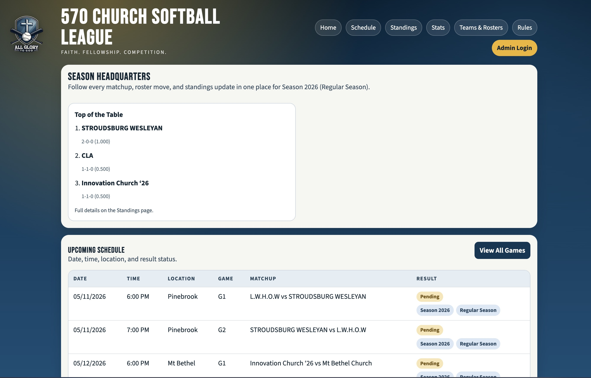

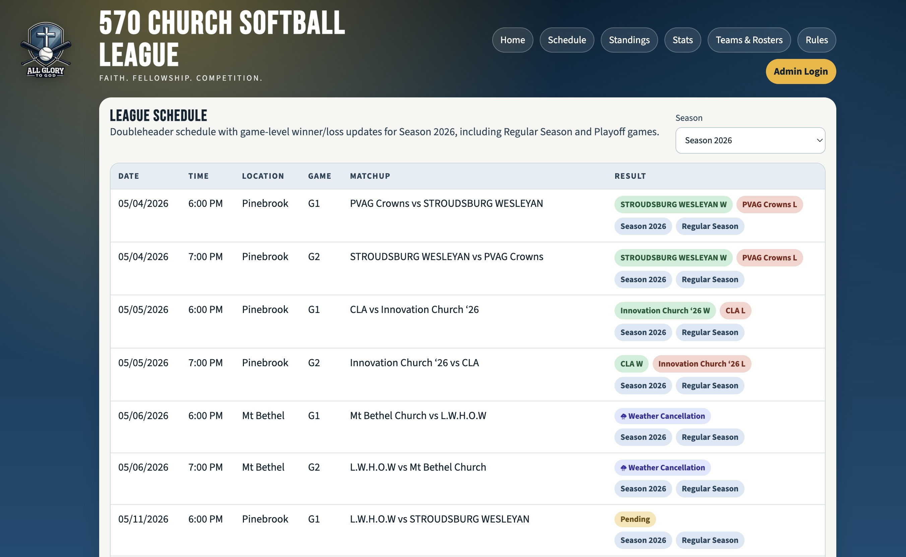

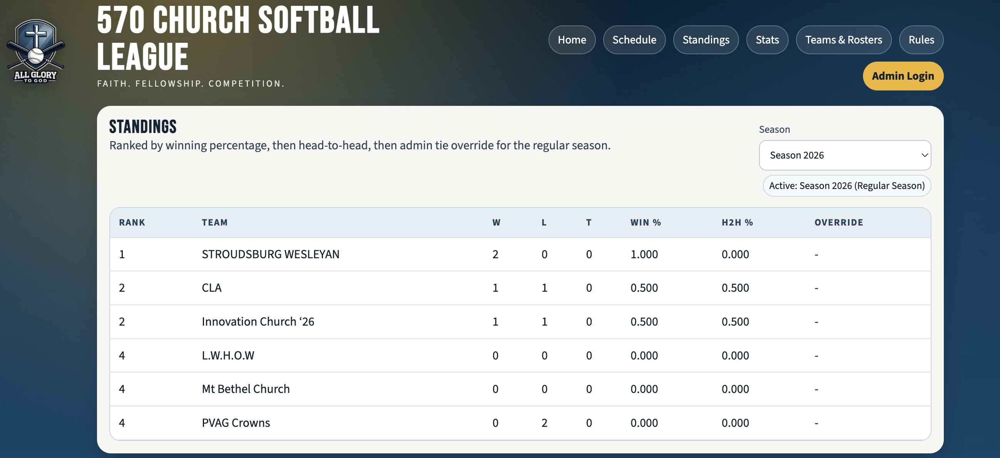

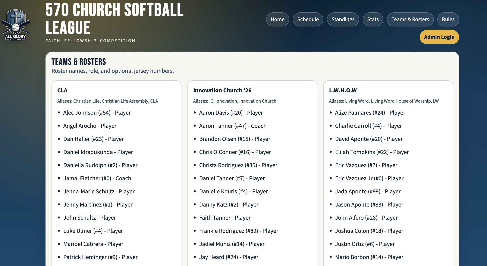

### Pages Only Admins Can See

Admins log in at `/admin/login`. Once logged in, they get access to:

| Admin Page | What It Does |
|------------|-------------|
| **Dashboard** (`/admin/dashboard`) | Overview of teams, games, standings; GameChanger setup; invite other admins |
| **Teams** (`/admin/teams`) | Create and manage teams, set short names and SMS aliases |
| **Rosters** (`/admin/rosters`) | Add/edit/remove players and coaches, assign jersey numbers |
| **Schedule** (`/admin/schedule`) | Build the game schedule, manage seasons and playoff phase |
| **Quick Result** (`/admin/quick-result`) | Fast way to enter a game result without texting |
| **Standings** (`/admin/standings`) | View standings and set tiebreaker priorities |
| **Rules** (`/admin/rules`) | Edit the public rules page |
| **SMS** (`/admin/sms`) | Manage which phone numbers are allowed to text in results |
| **Scorebook** (`/admin/scorebook`) | Upload a photo of a paper scorebook — AI reads the stats for you |
| **Correct Stats** (`/admin/correct-stats`) | Fix any batting stats that were entered wrong |

---

## Special Features

### Text a Game Result from Your Phone

One of the most useful features: instead of logging into the website to enter a game result, an approved person can just **send a text message** and the website updates automatically.

**How it works:**
1. An admin adds your phone number to the approved list at `/admin/sms`.
2. You get the league's Twilio phone number (set up in Step 3 below).
3. After a game, you send a text to that number using one of the formats below.
4. The website automatically finds the matching game and records the result.
5. You get a text back confirming it worked (or telling you what went wrong).

**Text formats for a win/loss:**
```
05/11 G1 Team A W Team B L
05/11/2026 G2 Team A W Team B L
```

**Text formats for a tie:**
```
05/11 G1 Team A T Team B T
05/11 G1 Team A vs Team B Tie game
```

**What the pieces mean:**
- `05/11` — The date of the game (month/day). You can also include the year: `05/11/2026`.
- `G1` or `G2` — Which game slot (Game 1 or Game 2). You can also write `1stgame`, `2ndgame`, `Game 1`, `Game 2`.
- `Team A` — The name or a short alias of one team. You don't have to spell it perfectly — the system looks up aliases.
- `W` or `L` — Win or Loss. Put `W` after the winning team and `L` after the losing team.
- `T` — Tie. Put `T` after both team names (or write "Tie game" at the end).

**Example:**
```
05/05 G1 Innovation Church W Christian Life Assembly L
```
→ Innovation Church wins Game 1 on May 5th. Christian Life Assembly loses.

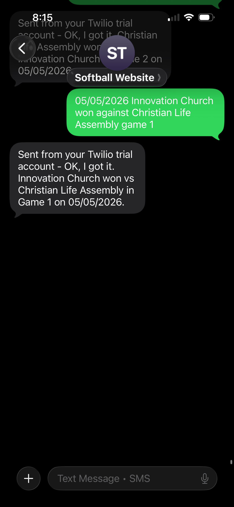

**What if something goes wrong?**
If the system can't figure out what you sent, it texts you back with a message explaining what it didn't understand — like if the team name didn't match anything, or the game wasn't found on the schedule. Just try again with a correction.

**Team aliases:**
Each team can have multiple "aliases" (short nicknames) that the SMS system recognizes. For example, "L.W.H.O.W" might have aliases like "LWHOW", "lwhow", "Love Work Hope". Admins manage these at `/admin/teams`.

---

### Live Scoreboard with GameChanger

If your league scores games using the **GameChanger** app, you can show a live scoreboard on the website's home page during game nights.

**What it looks like:**
On a game day, a "Live Scoreboard" panel appears on the home page. It shows the current score, inning, and game status — updating in real time as the scorer enters plays in the GameChanger app. The scoreboard is hidden completely when no game is actively being scored.


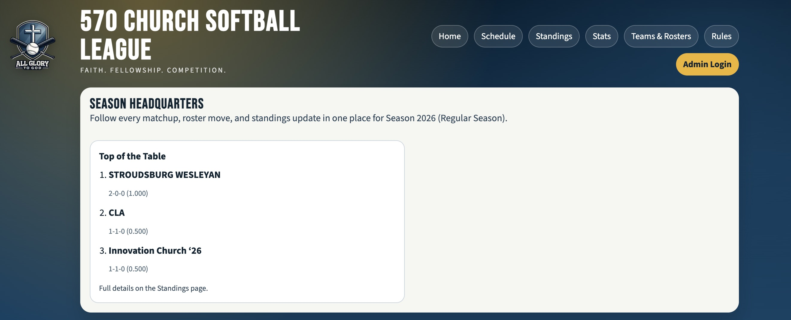

**How to set it up (do this once):**

1. Open the **GameChanger** app or website and go to your **organization's** page (not a specific team's page — the league-level page).
2. Look for a menu option called **Tools** or **Scoreboard Widget** or **Share**.
3. Find the option to create or embed a scoreboard widget. GameChanger will give you a small block of code or a URL.
4. In that code, find the `widgetId` — it looks like a long string of letters and numbers with dashes: `xxxxxxxx-xxxx-xxxx-xxxx-xxxxxxxxxxxx`.
5. Go to your website's admin dashboard at `/admin/dashboard`.
6. Scroll to the **GameChanger Integration** section.
7. Paste that `widgetId` into the **Scoreboard Widget ID** field and save.

That's it. On the next game day, the live scoreboard will appear on the home page automatically.

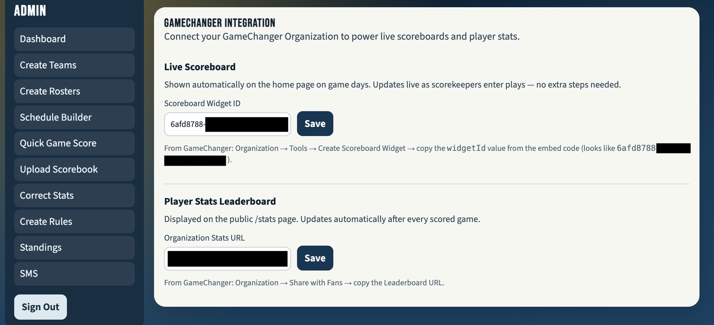

---

### Batting Stats from GameChanger

The **Stats page** (`/stats`) shows a batting leaderboard for the whole league. It pulls data from each team's GameChanger page automatically every night.

**What stats are shown:**
Games Played (GP), At-Bats (AB), Runs (R), Hits (H), Doubles (2B), Triples (3B), Home Runs (HR), RBI, Walks (BB), Strikeouts (SO), and Batting Average (AVG).

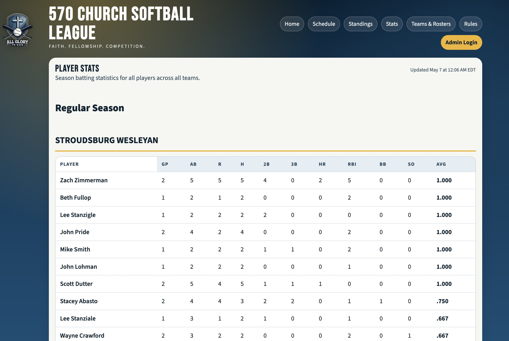

**How it works:**
A GitHub Actions job runs automatically every night at around 9:15 PM Eastern Time. It visits each team's GameChanger schedule page, reads the stats, and saves them to the database. The stats page on the website then shows the latest numbers.

**How to set it up (see [Step 12](#step-12--set-up-nightly-stats-sync-optional) for full details).**

**How to find your GameChanger Organization URL:**

The organization URL is used to link to the full stats leaderboard on GameChanger. Here's how to find it:

1. Go to [web.gc.com](https://web.gc.com) and log in.
2. Click on your **organization** (the league, not a specific team).
3. Look for a **Share with Fans** or **Leaderboard** link. Copy the URL from your browser.
4. It will look something like: `https://web.gc.com/organizations/ABC123/schedule`
5. Go to `/admin/dashboard` → GameChanger Integration → paste it into the **Organization Stats URL** field.

**How to find your GameChanger Team URLs (for nightly stats sync):**

For each team in the league:
1. Go to [web.gc.com](https://web.gc.com) and log in.
2. Click on a **team** in your organization.
3. Go to their **Schedule** tab.
4. Copy the URL from your browser — it looks like: `https://web.gc.com/teams/TEAMID/2026-season-team-name/schedule`
5. You'll need one URL per team. These get saved as a GitHub Actions secret (see Step 12).

---

### Upload a Paper Scorebook

Some scorers keep stats on a **paper scorebook** instead of using GameChanger. This feature lets you take a photo of the scorebook page and have the website automatically read the batting stats from it using AI.

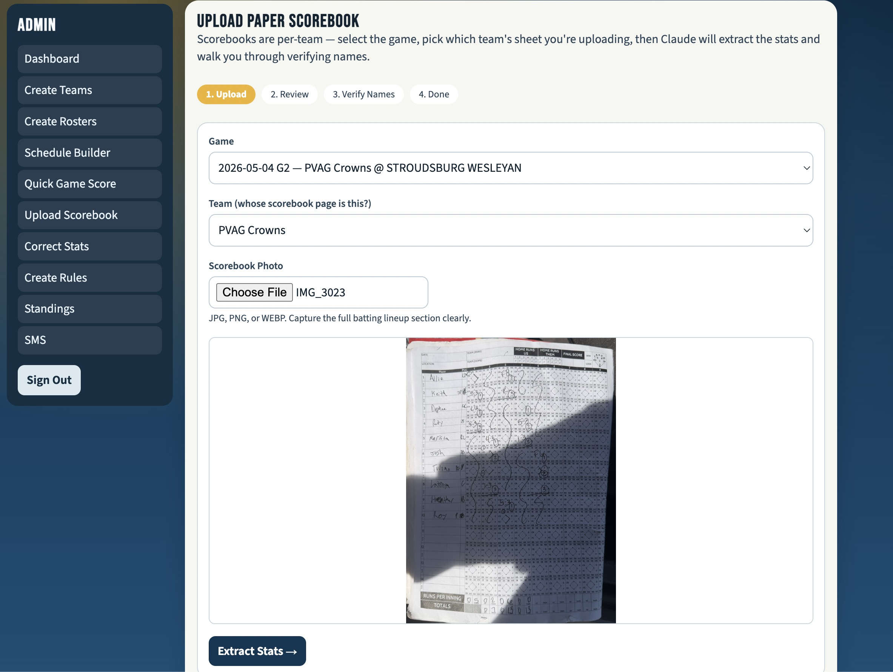

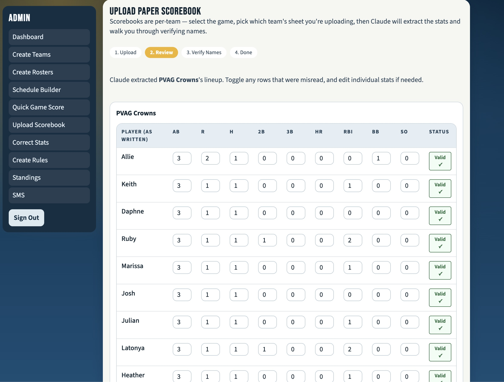

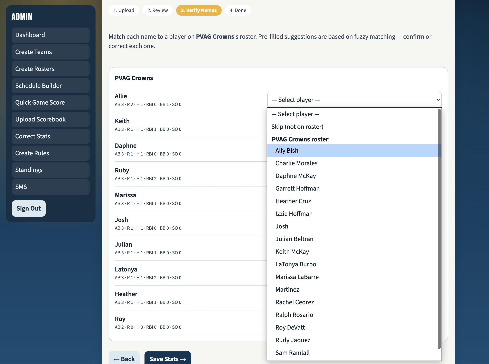

**How to use it:**

1. After a game, take a clear photo of the **batting page** of your paper scorebook (the page that shows each player's at-bats). Make sure the whole page is in the photo and it's not too dark or blurry.
2. Log in to the admin area and go to `/admin/scorebook`.
3. Select the **team** and **game date**.
4. Upload your photo.
5. The website sends the photo to an AI (Claude, made by Anthropic) which reads the handwritten grid of plays and figures out each player's stats.
6. You'll see a screen showing what the AI found — player names, at-bats, hits, walks, etc.
7. Review the results. If anything looks wrong, you can fix it before saving.
8. Click **Save** and the stats are added to the database.

**Tips for a good photo:**
- Take the photo in good lighting.
- Lay the scorebook flat so the page isn't curved.
- Make sure all player rows are visible.
- Avoid shadows across the page.

---

## Setting Everything Up From Scratch

### What You Need Before You Start

Before you can run this website, you need accounts at three services (all free to start):

| Service | What It's For | Sign Up |
|---------|--------------|---------|
| **Supabase** | Your database and admin login system | [supabase.com](https://supabase.com) |
| **Twilio** | Sending and receiving text messages | [twilio.com](https://twilio.com) |
| **Vercel** | Hosting your website on the internet | [vercel.com](https://vercel.com) |
| **Anthropic** | AI that reads paper scorebooks (optional) | [console.anthropic.com](https://console.anthropic.com) |
| **GitHub** | Storing your code and running nightly stats sync | [github.com](https://github.com) |

You also need **Node.js** installed on your computer if you want to run the site locally. Download it from [nodejs.org](https://nodejs.org) (choose the "LTS" version).

---

### Step 1 — Create a Supabase Project (Your Database)

Supabase is where all your data lives — teams, games, standings, players, everything.

1. Go to [supabase.com](https://supabase.com) and click **Start your project**.
2. Sign up with your GitHub account (easiest) or an email address.
3. Click **New Project**.
4. Fill in:
   - **Name:** Something like `570-church-softball`
   - **Database Password:** Choose a strong password — write it down somewhere safe.
   - **Region:** Pick the one closest to you (e.g., US East for Pennsylvania).
5. Click **Create new project** and wait about 2 minutes for it to finish setting up.
Once it's ready, you'll need three pieces of information from Supabase. Find them by going to your project and clicking **Settings** → **API**:

- **Project URL** — looks like `https://abcdefghijkl.supabase.co`
- **anon public key** — a long string starting with `eyJ...`
- **service_role key** — another long string starting with `eyJ...` (keep this secret — never share it)

Write all three of these down. You'll need them in Step 5.

---

### Step 2 — Run the Database Setup Script

Before the website can work, you need to create all the database tables. This is done using SQL scripts included in the project.

1. In your Supabase project, click **SQL Editor** in the left sidebar.
2. Click **New query**.
3. Open the file `supabase/migrations/20260213180000_league_schema.sql` from this project in a text editor, copy all of its contents, and paste it into the SQL editor.
4. Click **Run**.
5. Repeat for each file in the `supabase/migrations/` folder, **in order by filename** (the numbers at the start of each filename tell you the order).

If all the queries say "Success" you're good. If you see an error, read it carefully — most errors are because a script was run out of order.

---

### Step 3 — Set Up Twilio (SMS Texting)

Twilio gives you a real phone number that people can text to report game results.

1. Go to [twilio.com](https://twilio.com) and sign up for a free account.
2. Verify your phone number during signup (Twilio requires this).
3. On the Twilio dashboard, click **Get a trial phone number** (the free trial gives you a number you can test with).
4. Write down your new **Twilio phone number** (it will be in a format like `+15705551234`).
5. Go to **Account** → **API keys & tokens** and find your **Auth Token**. Write it down.

You'll need:
- **Twilio phone number** (the number people text)
- **Twilio Auth Token** (used to verify that texts are really coming from Twilio)

---

### Step 4 — Deploy to Vercel (Your Website Host)

Vercel will take your code and turn it into a live website that anyone can visit.

1. Push this code to a GitHub repository (if you haven't already):
   - Go to [github.com](https://github.com) and create a new repository.
   - Follow GitHub's instructions to push the code.
2. Go to [vercel.com](https://vercel.com) and sign in with your GitHub account.
3. Click **Add New Project**.
4. Find your GitHub repository in the list and click **Import**.
5. On the configuration screen:
   - **Framework Preset:** Should auto-detect as "Next.js" — leave it.
   - Don't change anything else yet.
6. Click **Deploy**.

Vercel will build and deploy your site. After a minute or two, it will give you a URL like `https://570-church-softball.vercel.app`. Visit that URL — the site is live! (It won't work properly yet because you haven't added your secrets, but you'll see the page.)

Write down your **site URL** (e.g., `https://570-church-softball.vercel.app`). You'll need it in the next step. You can also set up a custom domain later through Vercel's settings.

---

### Step 5 — Add Your Environment Variables to Vercel

"Environment variables" are secret settings your website needs to connect to Supabase, Twilio, and other services. Think of them like passwords that your app uses behind the scenes.

1. In Vercel, go to your project and click **Settings** → **Environment Variables**.
2. Add each of the following one at a time. For each one, click **Add New**, type the name, paste the value, make sure all three environments are checked (Production, Preview, Development), and click **Save**.

| Variable Name | Where to Find the Value |
|---------------|------------------------|
| `NEXT_PUBLIC_SUPABASE_URL` | Supabase → Settings → API → Project URL |
| `NEXT_PUBLIC_SUPABASE_ANON_KEY` | Supabase → Settings → API → anon public key |
| `SUPABASE_SERVICE_ROLE_KEY` | Supabase → Settings → API → service_role key ⚠️ Keep secret |
| `NEXT_PUBLIC_SITE_URL` | Your Vercel site URL, e.g. `https://570-church-softball.vercel.app` |
| `ADMIN_INVITE_REDIRECT_URL` | Your site URL + `/admin/create/login?invite=1`, e.g. `https://570-church-softball.vercel.app/admin/create/login?invite=1` |
| `TWILIO_AUTH_TOKEN` | Twilio → Account → API keys → Auth Token ⚠️ Keep secret |
| `TWILIO_WEBHOOK_URL` | Your site URL + `/api/twilio/inbound`, e.g. `https://570-church-softball.vercel.app/api/twilio/inbound` |
| `TWILIO_PHONE_NUMBER` | Your Twilio phone number, e.g. `+15705551234` |
| `ANTHROPIC_API_KEY` | Anthropic Console → API Keys (only needed for the paper scorebook feature) ⚠️ Keep secret |

> ⚠️ Variables marked "Keep secret" should never be shared with anyone or put in the code.

3. After adding all variables, go back to Vercel's **Deployments** tab and click **Redeploy** on the most recent deployment. This makes the site restart with your new settings.

---

### Step 6 — Connect Twilio to Your Website

Now you need to tell Twilio "when someone sends a text to my number, forward it to this website."

1. Log in to [twilio.com](https://twilio.com).
2. Go to **Phone Numbers** → **Manage** → **Active numbers**.
3. Click on your phone number.
4. Scroll down to the **Messaging** section.
5. Under **"A message comes in"**, choose **Webhook** from the dropdown.
6. In the URL box, type your webhook URL: `https://YOUR-SITE.vercel.app/api/twilio/inbound`
   (Replace `YOUR-SITE` with your actual Vercel URL.)
7. Make sure the method is set to **HTTP POST**.
8. Click **Save**.

Now, whenever anyone texts your Twilio number, Twilio will automatically forward that text to your website to process.

---

### Step 7 — Create Your First Admin Account

The website uses a secure login system. The very first admin account is created through a special "bootstrap" process.

1. In your Supabase project, go to **Authentication** → **URL Configuration**.
2. Set the **Site URL** to your Vercel site URL (e.g., `https://570-church-softball.vercel.app`).
3. Under **Redirect URLs**, add: `https://YOUR-SITE.vercel.app/admin/login`

Now create your admin account:

1. Visit your website at `/admin/login`.
2. You'll see a login form. Click **Bootstrap First Admin** (this only appears when no admins exist yet).
3. Enter your email address and choose a password.
4. Check your email — you'll get a confirmation link. Click it.
5. You're now logged in as an admin!

**To invite more admins later:**
1. Log in and go to `/admin/dashboard`.
2. Scroll to the **Admin Access** section.
3. Enter the new admin's email address and click **Send Invite**.
4. They'll receive an email with a link to set up their account.

---

### Step 8 — Add Your Teams

Now it's time to set up the teams in your league.

1. Log in to the admin area and go to `/admin/teams`.
2. Click **Add Team**.
3. Enter the team's full name (e.g., "Mt Bethel Church") and optionally a short name (e.g., "Mt Bethel").
4. Click **Save**.
5. Repeat for every team in the league.

**Add SMS aliases (important for texting results):**

Each team needs short nicknames the SMS system can recognize. For example, "L.W.H.O.W" is hard to type quickly, so you might add aliases like "LWHOW" and "lwhow".

1. After creating a team, click on it to see its details.
2. Under **Aliases**, click **Add Alias** and type a short name.
3. Add as many aliases as you want for each team.
4. Click **Save**.

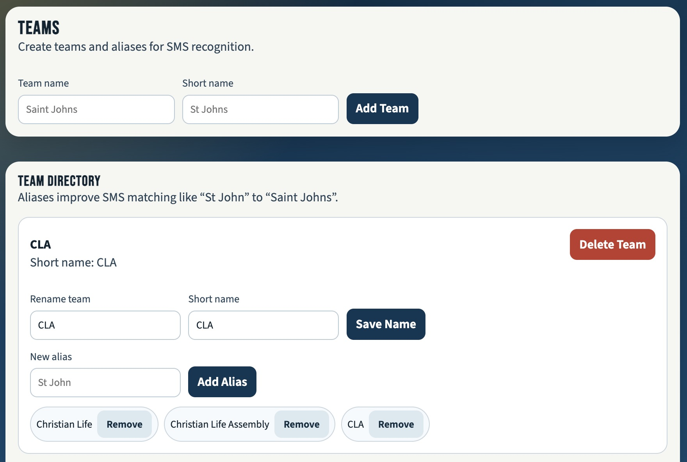

---

### Step 9 — Build Your Schedule

1. Go to `/admin/schedule`.
2. First, make sure the **Active Season** is set correctly. Look for the season settings at the top of the page — set the season name (e.g., "Season 2026") and make sure the phase is "Regular Season".
3. To add games, click **Add Game Slot** or **Add Doubleheader**.
4. Fill in:
   - **Date** — The date of the game.
   - **Time** — The start time (e.g., 6:00 PM).
   - **Location** — Where it's being played (e.g., "Pinebrook").
   - **Home Team** and **Away Team** — Pick from your teams.
   - **Game Number** — G1 (first game of the night) or G2 (second game).
5. Click **Save**.

Repeat until every game is on the schedule.

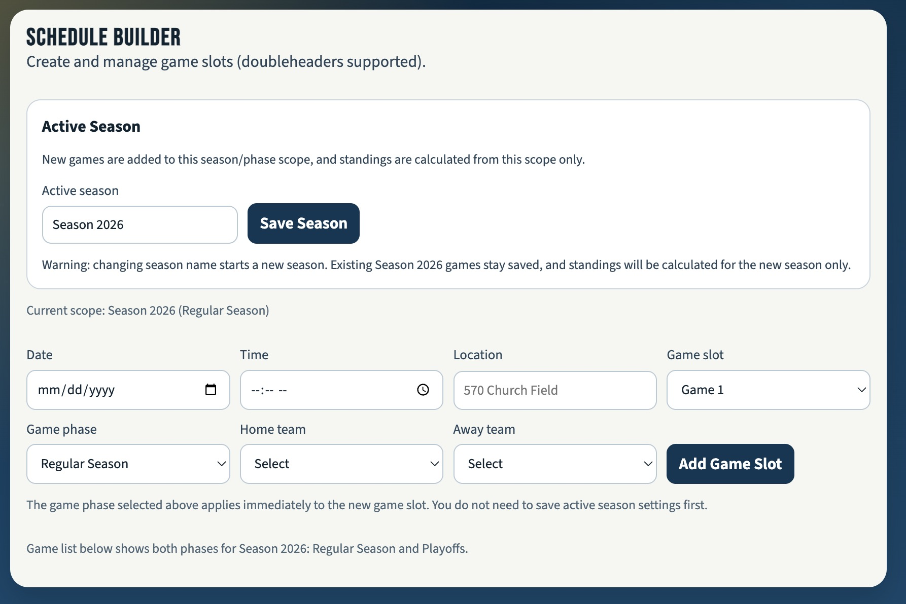

**Playoffs:**
When the regular season ends and playoffs begin:
1. Go to `/admin/schedule`.
2. Find the season phase setting and switch it to **Playoffs**.
3. Add your playoff games the same way.

---

### Step 10 — Allow Phone Numbers to Text Results

By default, nobody can text results to the Twilio number — you have to approve each phone number first.

1. Go to `/admin/sms`.
2. Click **Add Number**.
3. Enter the phone number in the format `+15705551234` (start with `+1` for US numbers, then the area code and number with no spaces or dashes).
4. Optionally add a label so you remember whose number it is (e.g., "Joel — scorekeeper").
5. Click **Save**.

Repeat for every person who should be allowed to text in results. Anyone not on this list will have their texts ignored.

---

### Step 11 — Connect GameChanger (Optional)

#### Live Scoreboard Widget

If you score games with the GameChanger app, you can embed a live scoreboard on your website:

1. Log in to [web.gc.com](https://web.gc.com) with your GameChanger account.
2. Navigate to your **organization** (the league-level page, not a specific team).
3. Look for **Tools** in the navigation menu.
4. Find the **Scoreboard Widget** option. Click it.
5. GameChanger will show you an embed code. Look for `widgetId` in the code. It looks like:
   ```
   widgetId: "xxxxxxxx-xxxx-xxxx-xxxx-xxxxxxxxxxxx"
   ```
6. Copy just that ID (without quotes).
7. In your website admin dashboard at `/admin/dashboard`, scroll to **GameChanger Integration**.
8. Paste the ID into the **Scoreboard Widget ID** field.
9. Click **Save**.

#### Organization Stats URL

This links your Stats page to the official GameChanger leaderboard:

1. At [web.gc.com](https://web.gc.com), go to your organization page.
2. Find **Share with Fans** or **Leaderboard** and open it.
3. Copy the URL from your browser's address bar — it looks like:
   `https://web.gc.com/organizations/XXXXXXXX/leaderboard`
4. In `/admin/dashboard` → **GameChanger Integration**, paste it into the **Organization Stats URL** field.
5. Click **Save**.

---

### Step 12 — Set Up Nightly Stats Sync (Optional)

This feature automatically pulls batting stats from GameChanger every night. It uses **GitHub Actions** (a free automation tool built into GitHub).

**What you need:**
- Your GameChanger login session (explained below).
- The schedule URL for each team on GameChanger.

#### Getting Your GameChanger Session

The stats sync script needs to log into GameChanger to read stats. You'll save a "session" (think of it like a saved login) as a GitHub secret.

1. Log in to [web.gc.com](https://web.gc.com) in your browser.
2. Open your browser's developer tools:
   - **Chrome/Edge:** Press `F12` or right-click → Inspect.
   - **Safari:** Enable developer tools in Safari settings first, then press `Option+Cmd+I`.
3. Go to the **Application** tab (Chrome) or **Storage** tab (Safari).
4. Find **Cookies** → `web.gc.com`.
5. You'll see a list of cookies. The script needs all of them. Use the export/copy feature of your browser dev tools to save them, or run `node scripts/save-gc-session.mjs` if you have the project set up locally.
6. The result is a JSON block that looks like `{"cookies": [...], "origins": [...]}`.

#### Finding Team Schedule URLs

For each team, get their GameChanger schedule URL:
1. At [web.gc.com](https://web.gc.com), go to your organization and click on a team.
2. Click the **Schedule** tab.
3. Copy the URL — it looks like: `https://web.gc.com/teams/TEAMID/2026-season-team-name/schedule`
4. Repeat for every team in the league.
5. Join all the URLs together with commas (no spaces): `https://web.gc.com/teams/TEAM1.../schedule,https://web.gc.com/teams/TEAM2.../schedule`

#### Adding GitHub Secrets

1. Go to your GitHub repository.
2. Click **Settings** → **Secrets and variables** → **Actions**.
3. Click **New repository secret** for each of the following:

| Secret Name | Value |
|-------------|-------|
| `SUPABASE_URL` | Your Supabase project URL (same as `NEXT_PUBLIC_SUPABASE_URL`) |
| `SUPABASE_SERVICE_ROLE_KEY` | Your Supabase service role key |
| `GC_SESSION` | The full JSON session you exported from your browser |
| `GC_TEAM_URLS` | All team schedule URLs joined with commas |
| `GC_SEASON_START` | First day of the season in `YYYY-MM-DD` format, e.g. `2026-04-01` |
| `GC_SEASON_END` | Last day of regular season in `YYYY-MM-DD` format |
| `GC_PLAYOFF_START` | First day of playoffs in `YYYY-MM-DD` format (can be same as season end if no playoffs) |

4. After adding all secrets, go to the **Actions** tab in your GitHub repository.
5. Find the **Sync GameChanger Stats** workflow.
6. Click **Run workflow** → **Run workflow** to test it manually.
7. Wait about 5 minutes. If it succeeds (green checkmark), stats will appear on the Stats page of your website.

After the first successful run, the workflow automatically runs every night at approximately 9:15 PM Eastern Time.

---

## Day-to-Day Use

### Reporting a Result by Text

After a game, text the result to your Twilio phone number:

```
05/11 G1 Mt Bethel W LWHOW L
```

You'll get a confirmation text back. If there's an error (wrong team name, wrong date, etc.) the reply will tell you what to fix.

**Double-check:** The game must already be on the schedule. If you're trying to report a game that doesn't exist yet, the system won't find it.

### Reporting a Result Manually

If you can't text it or something went wrong:

1. Log in and go to `/admin/quick-result`.
2. Select the game from the dropdown.
3. Choose the winner (or mark it as a tie).
4. Click **Save**.

You can also click the **Edit** button next to any game on the Schedule page (`/schedule`) if you're logged in.

### Recording Stats from a Paper Scorebook

1. Take a clear, well-lit photo of the batting page of your scorebook.
2. Log in and go to `/admin/scorebook`.
3. Pick the team, game date, and whether it's a regular season or playoff game.
4. Upload your photo.
5. Wait a few seconds while the AI reads it.
6. Review the stats on screen — fix any mistakes.
7. Click **Save**.

If a player's name on the scorebook doesn't exactly match their name in the roster, the system will ask you to match them up.

### Running the Season

**Starting the season:**
- Make sure all teams are created in `/admin/teams`.
- Build the full schedule in `/admin/schedule`.
- Add approved SMS reporters in `/admin/sms`.

**During the season:**
- Results come in via text or manual entry.
- Standings update automatically after each result.
- Stats sync every night from GameChanger (or enter them manually via scorebook upload).

**At the end of regular season / start of playoffs:**
1. Go to `/admin/schedule`.
2. Change the active competition phase to **Playoffs**.
3. Add playoff games to the schedule.
4. Standings for the playoff phase will track separately.

**Starting a new season:**
1. Go to `/admin/schedule`.
2. Update the season name (e.g., change "Season 2026" to "Season 2027").
3. Set the phase back to **Regular Season**.
4. Add the new schedule.

Old seasons' data stays in the database. You can view past seasons on the Schedule and Standings pages using the season picker dropdown.

---

## Admin Pages Reference

| URL | What It's For |
|-----|--------------|
| `/admin/login` | Log in to the admin area |
| `/admin/dashboard` | Main admin hub — overview, GameChanger setup, invite admins |
| `/admin/teams` | Create teams, add SMS aliases |
| `/admin/rosters` | Manage player and coach rosters |
| `/admin/schedule` | Build the game schedule, manage seasons |
| `/admin/quick-result` | Quickly enter a game result |
| `/admin/standings` | View standings, set tiebreaker priorities |
| `/admin/rules` | Edit the public rules page |
| `/admin/sms` | Manage approved SMS reporter numbers |
| `/admin/scorebook` | Upload a paper scorebook photo for AI stat extraction |
| `/admin/correct-stats` | Fix incorrect batting stats |

---

## Tech Stack

For the technically curious:

| Technology | What It Does |
|------------|-------------|
| **Next.js 16** (App Router) | The web framework — handles pages, routing, and server-side logic |
| **TypeScript** | Programming language used throughout |
| **Supabase** | Database (PostgreSQL) + authentication system |
| **Twilio** | Sends and receives SMS text messages |
| **Vercel** | Hosts the website |
| **GameChanger** | Sports scoring app — provides live scoreboard widget and batting stats |
| **Anthropic Claude** | AI model that reads handwritten paper scorebooks |
| **GitHub Actions** | Runs the nightly stats sync job automatically |
| **Playwright** | Browser automation used by the stats sync script |
